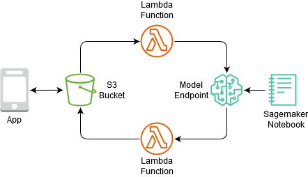

# TossItRight

TossItRight is a recylcing app that let's you snap a picture of the item you want to get rid off and tells you how to properly dispose it. This project was done as part of CUhackit 2020, a 24-hour hackathon at Clemson University. 

## Team
[Kevin Thomas](https://github.com/KevinThomas441)  
[Shikha Bhattarai](https://github.com/shikha-bhattarai)  
[Janani Arunachalam](https://github.com/jananiarunachalam)

## Architecture

The frond-end to the app can we found [here](https://github.com/shikha-bhattarai/TossItRightDemo).

## Tools
<ul>
<li>Amazon Sagemaker
<li>Amazon S3
<li>Amazon EC2 
<li>AWS Lambda
<li>fastai
<li>Jupyter Notebooks
<li>Javascript
<li>HTML5
<li>CSS3
</ul>
